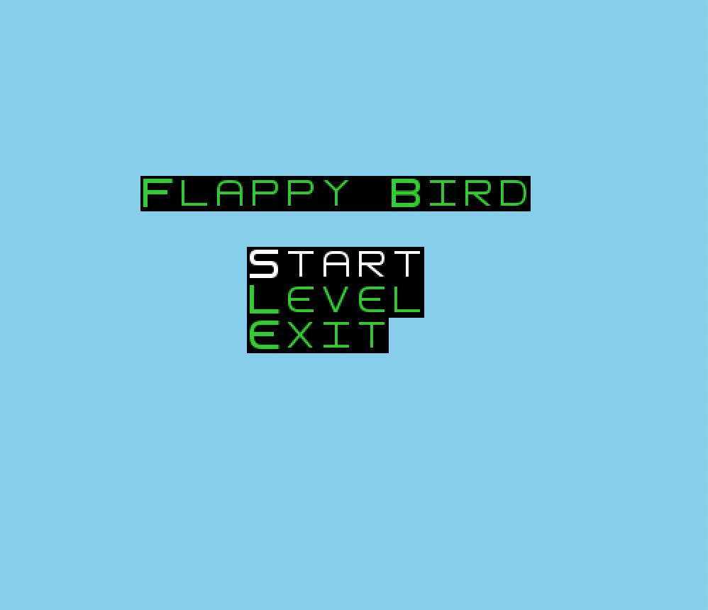
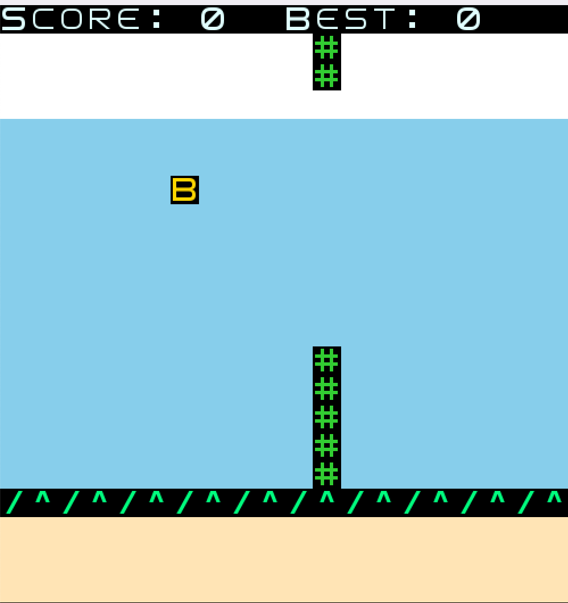

# Software Design and Testing Laboratory

## FLAPPYBIRD

> **WELCOME TO FLAPPYBIRD!**  

This project is a version of the classic FlappyBird game.
Fly with the yellow bird Tom without hitting the pipes. Can you do it?

> **INSTRUCTIONS**

**MENU**: The Menu consists of Start, Level, and Exit. Use the Up and Down arrow keys on the keyboard to move through the Menu, and the Enter key to select an option.  
Start: Starts the game,
Level: goes to the level menu to choose the game difficulty, and
Exit: closes the application.

**HOW TO PLAY**: Use the Up arrow key on the keyboard to fly up. Don’t let the bird fall to the ground or hit a pipe.
Press the **q** key on the keyboard to return to the main menu.

> **REPORT**

To read the full report on this project, click here: [Report](docs/Report.md)

> **GAME**

