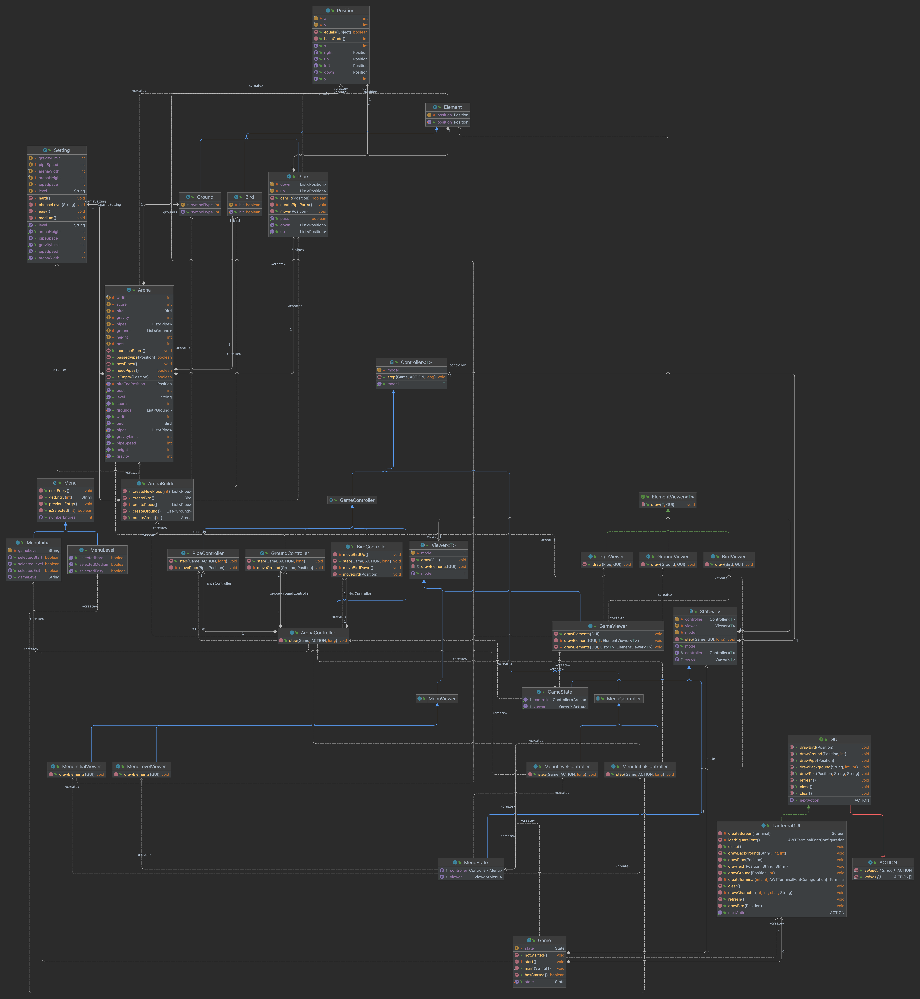
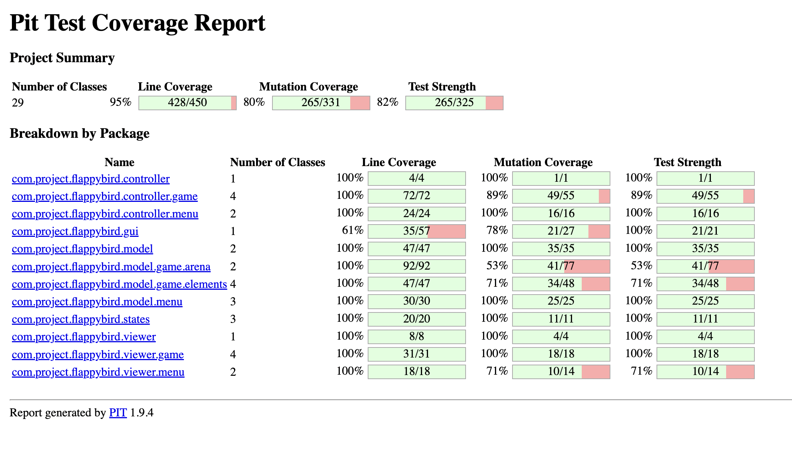

# LDTS_T12_G06 - FLAPPY BIRD

>### GAME DESCRIPTION

Neste incrível jogo você ajudará o pássaro Amarelo a voar sem se machucar. Para isso, será necessário desviar dos canos no meio do caminho
e evitar colidir com o chão. Cuidado com a gravidade local, ela pode te atrapalhar. Quanto mais canos desviar, maior será sua pontuação!
Você poderá escolher entre três diferentes leveis de dificultade.
Divirta-se!

Esse projeto foi desenvolvido por Luiz Queiroz.

## FEATURES

>### IMPLEMENTED FEATURES

- **Menu Inicial**: Menu para iniciar o jogo, escolher menu level ou sair do jogo
- **Menu Level**: Menu para selecionar o level de dificuldade do jogo entre: Easy, Medium e Hard
- **Arena**: A visualização do ambiente que o jogo se desenvolve
- **Jornada**: O jogo volta ao estado inicial sempre que o pássaro bate num cano ou no chão, contabilizando os feitos do jogador para que o jogador tenha diversas tentativas até que seja apertada a tecla 'q'. Deste modo, a jornada se encerra e o jogo volta para o Menu 
- **Bater Asas**: O pássaro irá subir quando a seta para cima do teclado for pressionada
- **Start**: A rodada só irá se iniciar se a seta para cima do teclado for pressionada para o pássaro começar a subir
- **Queda Livre**: O pássaro caso não esteja batendo asas, irá sofrer a ação da gravidade e cair
- **Limite de Subida**: O pássaro só poderá subir um nível especificado acima da tela do jogo.
- **Score**: Conta a quantidade de canos pelos quais o pássaro passou naquela rodada
- **Best**: Indica a pontuação mais alta que o jogador obteve dentro de uma mesma jornada
- **Batida**: O jogador irá perder a rodada se o pássaro bater no cano ou no chão
- **Movimento do Pássaro**: O pássaro é impedido de fazer qualquer movimento que não seja com a seta para cima do teclado, qualquer outra tecla estará bloqueada
- **Movimento dos Canos**: Os canos vão aparecer da direita para esquerda
- **Movimento do chão**: O chão irá se mover durante o jogo alteranando entre os símbolos '^' e '/' 
- **Alinhamento dos Canos**: O cano superior e o cano inferior estarão alinhados criando uma fenda por onde o pássaro deverá passar
- **Aleatoridade da Fenda**: Cada novo cano terá uma fenda que irá aparecer numa altura aleatória durante a rodada
- **Sensação de Movimento**: O jogo se movimentará dando a impressão de que o pássaro segue sempre para a direita

>### PLANNED FEATURES

- Todas as funcionalidades planejadas foram implementadas.

## DESIGN

>### O JOGO DEVE SE APRESENTAR DIFERENTE DEPENDENDO DO SEU ESTADO

**Problem in Context:**

Necessidade de utilizar várias lógicas condicionais para fazer as mudanças de menu para área do jogo e da área do jogo para o menu, levando em conta as opções selecionadas pelo usuário. 
Além disso, há também a dificuldade da manutenção do código, já que com a alteração de algo no código poderia inteferir no funcionamento de outras partes.

**The Pattern:**

O padrão aplicado foi o State Pattern. Ele possibilita representar diferentes estados em diferentes subclasses. Com isso, é possível mudar de diferentes estados mudando para outra subclasse. 
Deste modo, simplifica a maneira de mudança de estado, pois irá diminuir a quantidade de lógicas condicionais, já que irá encapsular o comportamento do objeto e trocá-lo dependendo do seu estado interno. 
Consequentemente, também facilitará na manutenção do código, pois o código se tornará mais limpo e menos encadeado.

**Implementation:**

A implementação se deu a partir de uma classe abstrata chamada State e duas subclasses chamadas GameState e MenuState. 
Dessa forma, a classe Game que possui um objeto da classe State, pode mudar seu estado através desse objeto passando de menu para a área do jogo ou da área do jogo para o menu.
Cada estado com seus diferentes tipos de visualização e controle oferecido ao usuário, sendo realizado pelo método comum as subclasses: o step e a mudança de estado sendo realizada pelo método setState da classe Game. 

**Consequences:**

O uso do state pattern trouxe mais legibilidade do código, além disso, fez com que a mudança de estado entre o menu e área do jogo e vice-versa fosse mais simples de ser feita e com menos usos de if e switch statements.
Com isso, a manutenção de alguma parte do código também se torna mais simples ao possuir uma classe do estado específico em que se pretende fazer a alteração.

>### O JOGO TEM UM CICLO DE MOSTRAR AS INFORMAÇÕES, RECEBER COMANDOS E ATUALIZAR AS INFORMAÇÕES COM OS COMANDOS

**Problem in Context:**

Por se tratar de um jogo, existe um ciclo que se desenvolve pelo usuário recebendo as informações visualmente, aplicando comandos disponíveis e os comandos sendo processados para que as informações mostradas ao usuário sejam atualizadas de acordo com o comando dado. 
Assim, é preciso organizar o código de forma a levar em consideração essa realidade.

**The Pattern:**

O padrão aplicado foi o Model-View-Controller Architectural Pattern.  
Este pattern permite a divisão do código em 3 partes essencias: Model (responsável pelos dados e de que forma eles são mantidos), Viewer (responsável pela parte de visualização de dados e será onde o usuário solicitará as ações para o controller) e Controller (responsável por fornecer os dados para o viewer e interpretar os comandos dados pelo usuário).
Portanto, a utilização do MVC Architectural pattern combina com o ciclo de controle e visualização de dados por um usuário, como num jogo, e serve para garantir a sincronização de dados e renderização dos inputs do usuário.

**Implementation:**

A implementação se deu a partir da divisão em três packages chamados de viewer, model e controller. 
No model se encontra quais os dados e como eles são organizados, variando de acordo com o estado em questão, podendo estar modelados para o menu ou o jogo em si. No jogo, os dados ficam organizados referente a ambientação do jogo e os elementos (como pássaro, chão e canos) que são utilizados nessa ambientação.
Já no viewer estão as formas que os dados serão mostradas através do método draw, dependendo do estado em questão (menu ou jogo) e do tipo de dado (pássaro, chão e canos).
Por fim, o controller onde se encontra a forma como o usuário poderá controlar e alterar os dados, que serão feitos através do método step, dependendo do estado e tipo de dado, com auxílio de um objeto chamado action que possui informação sobre comando exercicido pelo usuário.

**Consequences:**

O uso do MVC architectural pattern trouxe otimização da gestão do código para gerenciamento do jogo.
Além disso, é possível localizar e particionar as funções mais propriamente, gerando uma maior eficiência para futuras implementações.

>### O JOGO POSSUI CLASSES QUE NÃO CONSEGUEM ANTECIPAR A CLASSE DE OBJETOS QUE DEVE CRIAR

**Problem in Context:**

O jogo, conforme já dito, possui dois estados, menu e game. Cada um desses estados tem seus próprios métodos de controller e viewer. Entretanto, a classe base State não consegue antecipar qual das subclasses que irá ser criada: MenuState ou GameState e, assim, qual método para controller e viewer utilizar em cada uma.
Por isso, é preciso que essas subclasses especifiquem os objetos que usarão para o controller e viewer, para que esses objetos de controller e viewer possam ser relacionados a Menu, se a classe for MenuState ou relacionados a Game, se a classe for GameStat, e desta forma, utilizar seus métodos adequadamente. 

**The Pattern:**

O padrão aplicado foi o Factory-Method Pattern.  
Este pattern permite que exista uma classe Criator, que usa um factory method para lidar com o problema de criar seus os seus objetos, chamados de products, sem ter que especificar a classe exata desses objetos. Já que as subclasses, chamadas de ConcreteCreator, irão definir a instanciação do objeto, podendo ser a partir de uma classe, chamada de ConcreteProduct, que seja subclasse de uma classe chamada de Product.

**Implementation:**

A implementação se deu a partir da classe State, chamada de Creator, onde possui factory methods chamados de getViewer e getController. Esses métodos são implementados nas subclasses MenuState e GameState, chamadas de ConcreteCreator.
Essas subclasses conseguem, então, fazer a instanciação dos objetos, chamados de products, utilizando as subclasses MenuViewer e MenuController ou GameViewer e GameController, chamadas de ConcreteProducts e subclasses das classes Viewer e Controller chamadas de Products.

**Consequences:**

A classe State não precisa antecipar qual a implementação dos objetos controller e viewer que ela precisa criar. A responsabilidade dessa implementação fica a cargo das subclasses. 
Além disso, o código de criação do produto fica em um único lugar do programa, tornando mais simples para mudanças e correções. 

>### O JOGO PRECISA TER SEU FLUXO CONTROLADO

**Problem in Context:**

O jogo segue um fluxo onde irá executar o recebimento dos comandos inseridos pelo jogador, atualizar o estado do jogo e renderizar essas atualizações. 
Por isso, é preciso pensar em como esse fluxo será feito.

**The Pattern:**

O padrão aplicado foi o Game Loop Pattern.
Esse pattern faz com que um ciclo seja executando continuamente durante o jogo. Esse ciclo é dividido em 3 partes: a primeira parte recebe os comandos feitos pelo jogador, a segunda parte atualiza o estado do jogo com esse comando e última parte renderiza essas atualizações.
Assim, a cada ciclo será processado o comando do jogador, atualizado o estado do jogo e o jogo será renderizado.

**Implementation:**

A implementação se desenvolveu na class Game, onde o método start configura todo o funcionamento do pattern, criando o ciclo onde o fluxo do jogo será executado.
Este ciclo só irá terminar ao ser escolhida a opção Exit no Menu Inicial, já que essa informação será recebida e processada no ciclo, fazendo com que o estado do jogo seja atualizado para null e, com isso, o ciclo irá se encerrar, posteriormente encerrando o jogo também. 
Dentro desse ciclo, tenta se garantir um tempo de executação do ciclo constante para se ter uma suavidade no movimento do jogo e, além disso, é utilizado o método step da classe State que fará justamente a parte de receber
os comandos do jogador (com uso do método getNextAction() da classe LanternaGUI), processar esse comando através do objeto controller e renderizar através do objeto viewer.

**Consequences:**

O jogo consegue controlar seu fluxo seguindo sempre através do mesmo ciclo. Com isso, a executação do jogo será de receber o comando vindo do jogador, processar esse comando atualizando o estado do jogo e renderizar. 
Além disso, esse tempo de processamento do jogo no ciclo tende a ser constante garantindo um melhor controle da suavidade ao jogo.

>### O JOGO PODE TER UMA INTERFACE LIMITADA

**Problem in Context:**

É preciso usar algumas das funcionalidades disponível na Laterna library. Porém, o uso seria de uma quantidade bem restrita, 
não havendo necessidade de acoplar as classes criadas com detalhes da implementação de terceiros. 
Uma interface mais limitade supre as demandas que o jogo possui.

**The Pattern:**

O padrão aplicado foi o Facade Pattern. 
Esse pattern faz com que utilizando uma classe seja possível fornecer uma interface mais simples para as demandas que o jogo possui, assim é possível incluir somente as funcionalidades que realmente importam.

**Implementation:**

A implementação se desenvolveu com o uso da classe LaternaGUI. Com essa classe, foi criada uma interface mais simples utilizando somente o necessário da Laterna library e a comunicação no restante do código com a Laterna library é feita apenas através dessa classe.

**Consequences:**

O código foi isolado das complexidades da Laterna library. Assim, o código não fica dependende dos detalhes de implementação vindas da Laterna,
aumentando também a testabilidade e capacidade de substituição do código.

## UML

## Known Code Smells And Refactoring Suggestions

- **Large Class**

A classe Arena contém muitos atributos, métodos e linhas de código e a classe LanternaGUI contém muitos métodos e linhas de código.
Entretanto, nesses casos é compreensível pois a classe Arena é a principal classe do jogo, já que lida que faz parte do jogo mas grande parte dos métodos de criação da arena está na classe ArenaBuilder, diminuindo assim a quantidade de informação dessa classe.  
Já para LanternaGUI, ela atende a interface do jogo, então vários métodos são realmente necessários para esta classe. 

- **Data Class**

Classes como Bird e Ground podem ser consideradas Data Classes, já que elas contém somente atributos e crude métodos. 
Entretando, isso acontece por causa escolha do MVC Pattern que coloca a maior dos dados nas classes model, já que elas representam o modelo de algo do jogo que será mostrado pela parte view e controlado pela parte controller.
Ou seja, essa divisão pode ocasionar isso.

- **Lazy Classes**

GameState e MenuState podem ser consideradas Lazy Classes já que elas não fazem muita coisa. 
Entretando, GameState e MenuState são importantes pois ajudam a implementar o Factory Method Pattern.

- **Feature Envy**

Como foi escolhido o MVC Pattern, na maior parte das vezes os controllers acabam indo buscar os dados a serem usados com os seus models. 
Isso acaba gerando feature envy, já que ele é gerado pelo método acessar os dados de outra classe mais que os seus próprios. Entretanto, faz parte das escolhes feitas para o desenho do código.

- **Message Chains**

Ocorre principalmente pela classe Arena possuir todos os objetos que vão estar no jogo e como a classe ArenaController precisa acessar dados que estão na Arena,
muitas das vezes a Arena sozinha não possui esses dados, já que estão nos objetos que estão no jogo. 
É necessário, portanto, utilizar os métodos desses objetos para conseguir esses dados, causando message chains.
 

## TESTING

>### Screenshot of Coverage Report

>### Screenshot of Mutation Testing

